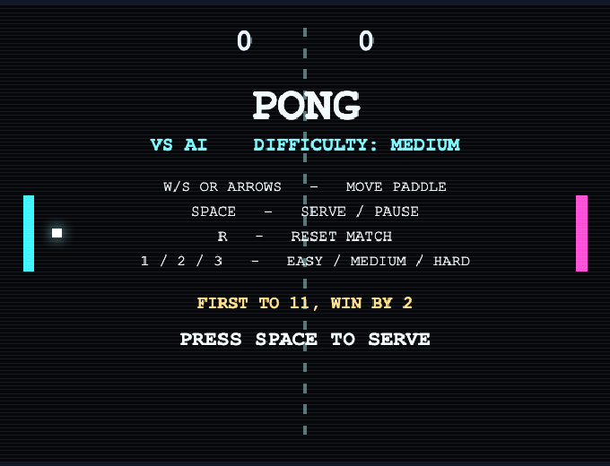

# Pong Arcade

A colorful retro-arcade Pong with a **deterministic TypeScript game core**. By
default you play against a fallible AI; press `0` to switch to local two-player
on a shared keyboard.

> Generated by [Protozoa](https://smartinfer.ai) (SmartInfer Inc.).



## What it is

- A single-canvas Pong that runs in the browser with no external assets.
- A DOM-free simulation core (`src/game.ts`, `src/ai.ts`) that is fully
  deterministic for a given seed and unit-tested in isolation.
- A thin rendering/input shell (`src/render.ts`, `src/main.ts`, `src/input.ts`)
  that never changes game behavior.

## Requirements

- Node.js >= 18
- npm

## Run it

```bash
npm install
npm run dev
```

Then open the dev server (Vite prints the URL, by default
`http://localhost:5173`).

### Play it in Chrome (exact command)

```bash
npm run dev
open -a "Google Chrome" http://localhost:5173
```

`open -a "Google Chrome"` launches the game in Google Chrome on macOS. Any
Chromium/Chrome browser pointed at that URL works the same way.

## Build and test

```bash
npm run build
npm test
```

## Controls

| Key | Action |
| --- | --- |
| W / S | Move the left paddle up / down |
| ArrowUp / ArrowDown | Move a paddle (left in vs-AI, right in two-player) |
| Space | Serve from the start screen, then pause / resume during play |
| R | Reset the current match |
| 1 / 2 / 3 | Set AI difficulty to Easy / Medium / Hard |
| 0 | Toggle player-vs-AI and local two-player |

The **start / help screen** shows the same legend on-screen: movement keys,
`Space` to serve/pause, `R` to reset, `1 / 2 / 3` for Easy / Medium / Hard, and
the match rule **first to 11, win by 2**.

### Two-player key split

- Left player: `W` / `S`
- Right player: `ArrowUp` / `ArrowDown`

## Player vs AI and difficulty levels

The default mode is **player vs AI**. The AI is deliberately fallible and
deterministic — its behavior is driven by three per-difficulty tables in
`src/ai.ts` that scale together:

| Difficulty | Paddle speed | Aim error | Reaction lag | Feel |
| --- | --- | --- | --- | --- |
| **1 · Easy** | slowest | largest | latest | visibly beatable |
| **2 · Medium** | medium | medium | medium | a real match |
| **3 · Hard** | fastest | smallest | earliest | strong, not perfect |

Speed rises Easy → Hard while aim error and reaction lag shrink, so the
difficulty ladder is monotonic. Even Hard never moves faster than a human
paddle (its speed factor stays below 1) and never teleports — it moves at most
its capped speed per update. A corner shot beats Easy and Medium. This ordering
is covered by the unit test suite.

Matches are **first to 11, win by 2**.

## Generation report

Pong Arcade was built end-to-end by **[Protozoa](https://smartinfer.ai)** — a spec
turned into a working, tested game, then hardened, re-tested, and patched, all
autonomously.

| | |
|---|---|
| Generator | Protozoa (SmartInfer Inc.) |
| Model | OpenAI GPT‑5.4 |
| Language | TypeScript (Vite) |
| Size | ~744 lines across 5 modules |

### Built in three autonomous passes

1. **Generate → test** — Protozoa turned a spec into the full game and verified it
   against an automated test suite.
2. **Harden → test** — it refined the gameplay feel and the AI difficulty ladder,
   re‑verifying at every step.
3. **Patch** — days later it fixed a side‑wall bug (steep returns collapsing toward
   the wall instead of bouncing away), locked in by a new regression test.

Every pass had to pass its tests before it was accepted — the platform never ships
a change its own tests reject.

### Verification

- `npm test` → **21/21 tests passing** (Vitest)
- `npm run build` → **passes** (Vite production build succeeds)
- Launches and renders in **Google Chrome** (see the screenshot above)

The gameplay core is deterministic and DOM‑free, so the tests exercise the real
simulation, not mocks, and need no network.

> We report no token, cost, or timing figures for this build: the early runs were
> not instrumented reliably, and we don't publish numbers we can't verify.

## Architecture note

The deterministic gameplay core lives in `game.ts` and `ai.ts`. Those modules
are DOM-free and unit-tested, which keeps rules, scoring, paddle motion, and AI
behavior predictable and easy to verify. Rendering and browser wiring stay
separate in `render.ts` and `main.ts`, so the visual layer can change without
altering core game behavior.

## Visual style

A bright retro-arcade look: cyan and magenta paddles, a glowing white ball, a
dashed center line, scanline shading across the playfield, and bold monospace
score, legend, and status text — colorful, readable, and fast, with the
deterministic simulation untouched underneath.
